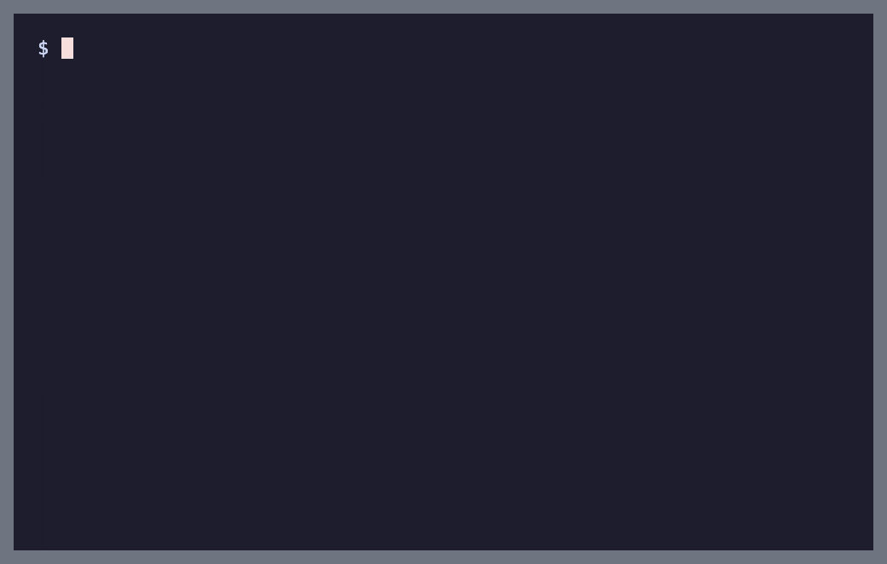
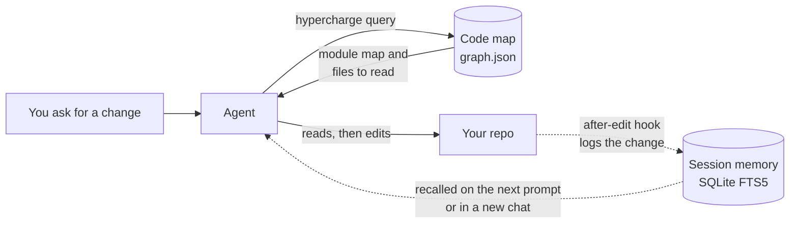
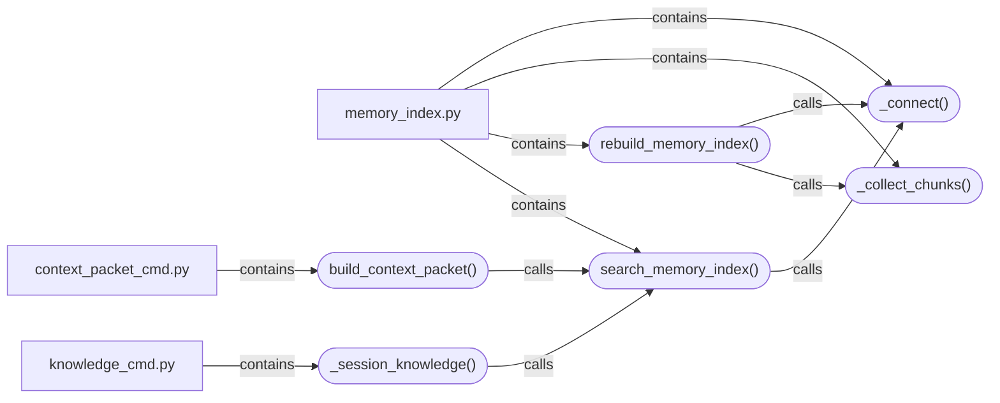

# Hypercharge

A code map, session memory and advisory hooks for Claude Code and Cursor, so the agent finds code before it edits it.

[](LICENSE)
[](pyproject.toml)
[](tests)



Coding agents often edit code they have not found yet: they guess a file name, change the first match and move on. Every new chat starts from nothing, so yesterday's decisions are gone. And they run shell commands with nothing checking them against what is actually known about the repo.

## What it does

- **Code map.** A tree-sitter graph of your files, functions and calls, built locally. The agent queries it before editing to find where things live.
- **Session memory.** Goals, decisions and notes from each chat are saved in the repo and indexed with SQLite full-text search, so a new chat can look up what earlier ones did.
- **Advisory safety hooks.** Hooks around shell and file access add warnings instead of blocking. In Cursor they run before a tool (network calls, subshells, files not yet looked up); in Claude Code they run after it (edits are logged, failed test runs are flagged).
- **Daily briefing and wrap-up.** A short briefing on where the repo stands, a morning list of loose ends, and an end-of-day wrap-up that refreshes the code map and memory index.

No separate LLM API key is needed: the map is built from syntax trees, and your own agent does the reading. The project has 262 automated tests.

## Install

Needs Python 3.11+ and git. Install once per machine:

```bash
git clone https://github.com/arukh281/Hypercharge-.git hypercharge
cd hypercharge
python3 -m venv .venv && source .venv/bin/activate
pip install -e .
hypercharge --version
```

## Quickstart

Wire it into your own project (not this repo):

```bash
cd /path/to/your-project
hypercharge onboard --path . --target claude   # or: cursor, both
hypercharge doctor
```

The first run installs graphify and the tree-sitter grammars from PyPI, builds the code map and deploys the hooks. Then open the project in Claude Code or Cursor and work as usual. The agent runs the commands; you can run them too:

```bash
hypercharge query "where is the memory index searched"
hypercharge wrapup --brief
```

| You say in chat | The agent runs |
|---|---|
| "What's going on?" | `hypercharge wrapup --brief` |
| "Start day" | `hypercharge wrapup --start-day` |
| "New topic: refactor the API" | `hypercharge new-chat --goal "…"` |
| "Wrap up" / "Done for the day" | `hypercharge wrapup` / `hypercharge wrapup --day` |

## How it works



1. **Before a change**, the agent asks the code map. The prompt hook also adds recent session notes and a short graph lookup to each prompt.
2. **The map answers** with the matching modules and the files to read, taken from the graph rather than guessed.
3. **After an edit**, a hook records the file in the session log and queues a map refresh for the next wrap-up.
4. **At wrap-up**, the chat is written to `.cursor/session/` and the memory index is rebuilt, so the next chat can search it.

### What the code map is

[graphify](https://pypi.org/project/graphifyy/) parses the repo with tree-sitter (languages such as Python, JavaScript, TypeScript, Go and Rust) and stores files and symbols as nodes, joined by edges such as `contains`, `calls` and `imports`. A few real nodes from this repo's own map:



Rectangles are files; pill shapes are functions. The map lives in `.cursor/graphify-out/graph.json`.

### What gets wired

| Piece | Where |
|---|---|
| Code map | `.cursor/graphify-out/graph.json`, rebuilt with `graphify update` (syntax only) |
| Session memory | Markdown in `.cursor/session/`, indexed in `.cursor/hypercharge/memory-index.sqlite` |
| Claude Code | hooks in `.claude/settings.json` and `.claude/hooks/`, a `CLAUDE.md` block, a repo skill, `.mcp.json` |
| Cursor | hooks in `.cursor/hooks.json`, rules in `.cursor/rules/`, `.cursor/mcp.json` |
| MCP server | `hypercharge mcp-server`, with `hypercharge_query`, `hypercharge_memory`, `hypercharge_log` and more |

To remove it: `hypercharge teardown --path .` (add `--target both` to delete the session files and map as well).

## Troubleshooting

| Symptom | Fix |
|---|---|
| `Hypercharge runtime missing` | `hypercharge setup --path . --target claude` in your repo root |
| Map missing or out of date | `hypercharge wrapup --day` |
| Claude Code hooks not firing | `hypercharge doctor --tier claude-hooks` |

Architecture notes: [ARCHITECTURE.md](ARCHITECTURE.md).

## Status

Alpha (v0.1.0). Tested on macOS (Apple Silicon) with Python 3.11+. Linux and Windows are untested.

## Licence and credits

Hypercharge is released under the MIT licence (see [`LICENSE`](LICENSE)). Copyright (c) 2026 Aradhya Khandelwal.

The MIT licence covers the Hypercharge code itself. Third-party components keep their own licences, and skill texts under `hypercharge/skill-packs/` that are adapted from other projects are licensed as stated in `hypercharge/skill-packs/ATTRIBUTION.md`.

- Code maps are built with [graphify](https://pypi.org/project/graphifyy/) and tree-sitter, installed from PyPI on first setup. They keep their own licences.
- Some bundled skills are adapted from [Trail of Bits skills](https://github.com/trailofbits/skills) (CC BY-SA 4.0) and [obra/superpowers](https://github.com/obra/superpowers) (MIT). See `hypercharge/skill-packs/ATTRIBUTION.md`.

The demo GIF is regenerated with `bash assets/render-demo.sh` (vhs, ffmpeg and gifsicle).
